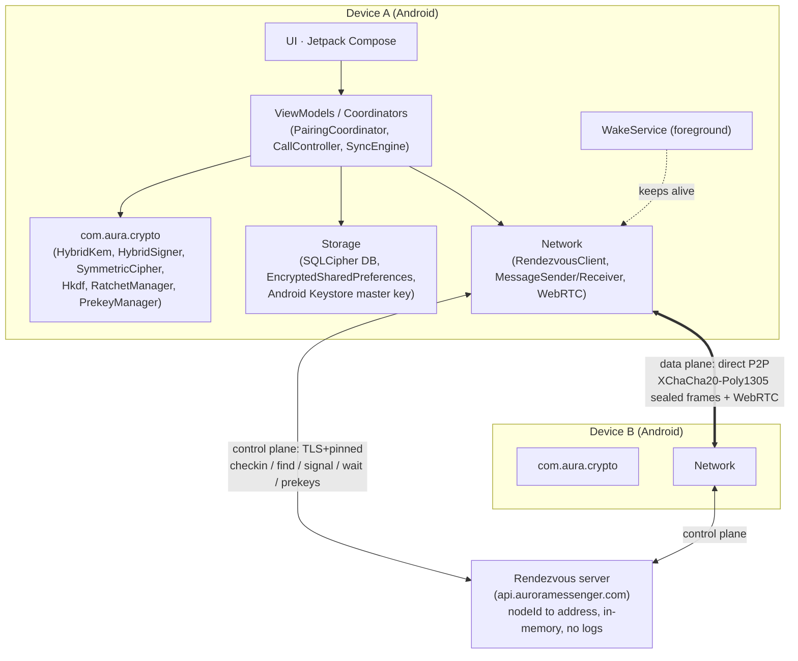
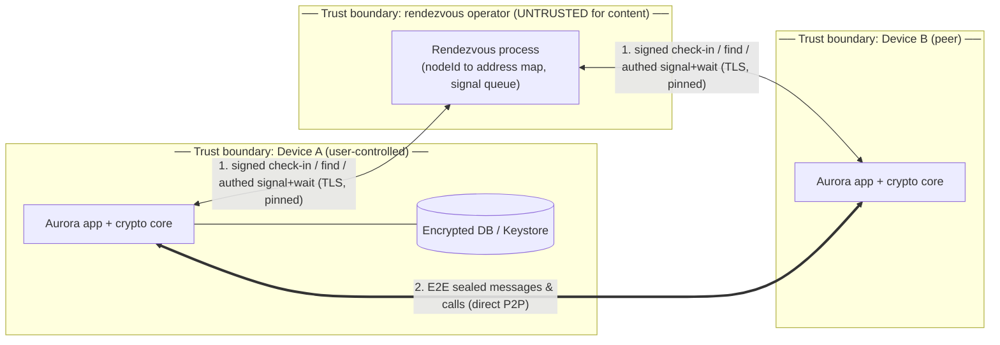
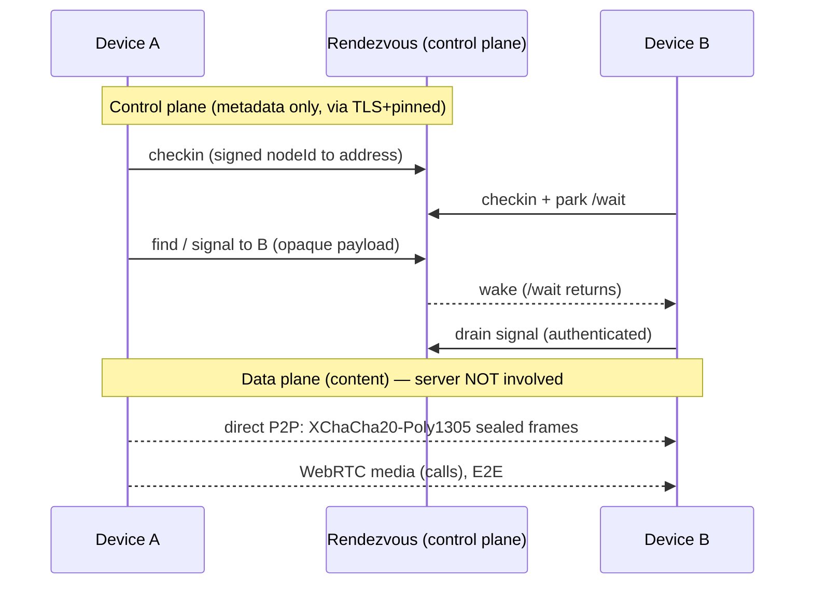
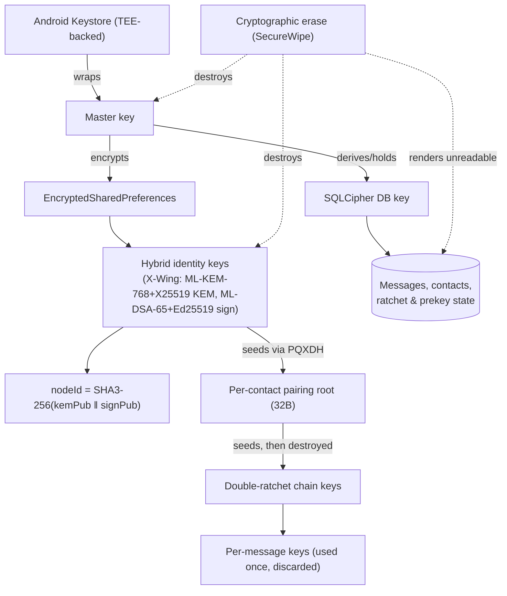
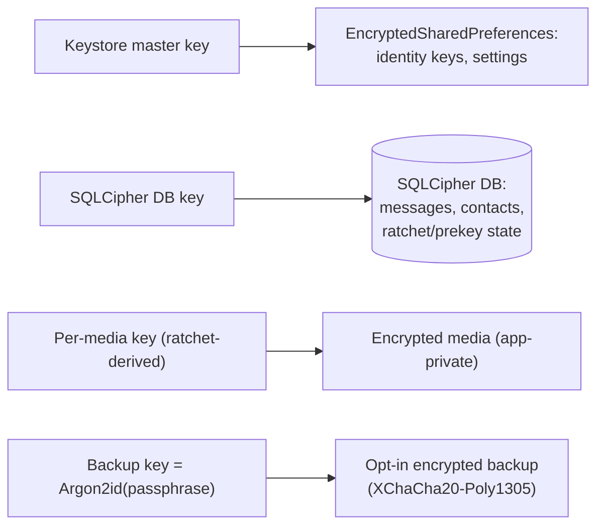
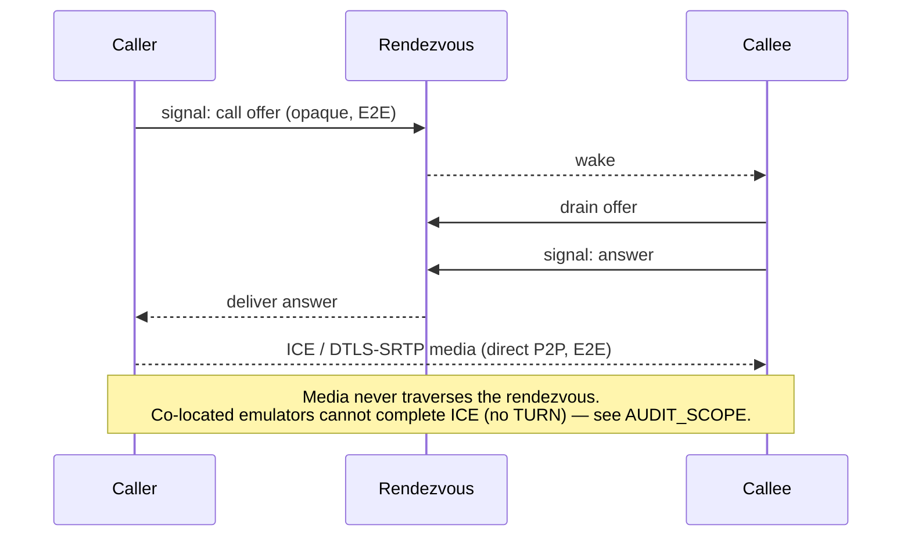

# Architecture & Trust Boundaries

This document maps Aurora's components, the **control-plane vs data-plane** split, and the
**trust boundaries** that the [threat model](THREAT_MODEL.md) reasons over. Diagrams are
Mermaid (render on GitHub).

## 1. Components

The crypto core (`crypto/`, `com.aura:aura-crypto`) is **Android-free** and persists through
storage interfaces (`RatchetStore`, `PrekeyStore`) the app implements — so it can be
reviewed and tested in isolation from the platform.

## 2. Trust-boundary data-flow diagram (DFD)

This is the canonical diagram the STRIDE analysis walks. Dashed boxes are trust boundaries.

**Boundaries & assumptions**
- **Device A / B (trusted to their own user):** holds private keys and plaintext. Endpoint
  compromise is an explicit non-goal.
- **Rendezvous operator (untrusted for content):** sees `nodeId → address` and that a device
  is reachable; never sees message content or private keys. Treated as a potential adversary
  in the threat model (a malicious or compromised operator).
- **Network (untrusted):** passive eavesdropper and active MITM assumed everywhere.

## 3. Control plane vs data plane

The server only helps peers *find* each other; it is never in the path of content.

## 4. Key hierarchy & lifecycle

Because post-quantum keys are too large for the Keystore TEE directly, they live in
EncryptedSharedPreferences under a Keystore-held master key (the pragmatic hardware-backed
compromise). Erase destroys keys, not bytes — keyless ciphertext is noise instantly.

## 5. Data-at-rest map

Details in [`DATA_AT_REST.md`](DATA_AT_REST.md) and [`KEY_MANAGEMENT.md`](KEY_MANAGEMENT.md).

## 6. Call setup (WebRTC)

Signaling (offer/answer/ICE candidates) is relayed as opaque payloads through the rendezvous
signal queue; media flows peer-to-peer and is end-to-end encrypted by WebRTC's DTLS-SRTP on
top of the authenticated session.
